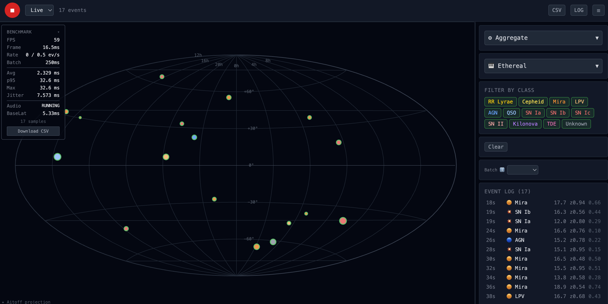

# Alert Data → Sound Mapping

Browser-based sonification of live alerts from the Vera C. Rubin Observatory (LSST).
Web Audio API + Vue 3 + D3.js + Kafka.

Transforms a stream of astronomical alerts into real-time multi-channel spatial audio.
[Full documentation](docs/plan.md) (Russian)



## Quick Start

```bash
make dev                  # backend + frontend-dev (Docker, demo alerts)
make dev ALERT_SOURCE=lasair LASAIR_API_KEY=<key>   # live Lasair alerts
make frontend             # build static for GitHub Pages
make deploy               # push to Hugging Face Space
```

## Architecture

```
GitHub Pages (SPA)          Hugging Face Space (Docker)
  Vue 3 + Vite               Node.js (Bun) + KafkaJS
  Web Audio API               WebSocket
  D3.js (Aitoff)              Lasair / LSST Kafka
  Tailwind CSS 4              Demo generator (fallback)
```

[Lasair](https://lasair.ac.uk) is a real-time alert stream broker for transient astronomical events, developed by the University of Edinburgh and Queen's University Belfast. It processes alerts from **ZTF (Zwicky Transient Facility)**, a wide-field sky survey at Palomar Observatory that scans the northern sky every two nights in three optical bands. ZTF detects supernovae, variable stars, active galactic nuclei, and other transient phenomena.

## Data Sources

| Source | Status | Auth |
|---|---|---|
| **Demo** | ✅ Built-in generator of synthetic LSST-like alerts | None |
| **Lasair** | ✅ Live ZTF alerts from [Lasair](https://lasair.ac.uk) Kafka broker | API key |
| **LSST Kafka** | ❌ Rubin Observatory not yet operational | SASL credentials |
| **Fink** | ❌ [Fink](https://fink-broker.org) API unavailable | None |

## Benchmark

The benchmark HUD (top-left corner) measures end-to-end sonification latency in real time.

**Metrics displayed:**
| Metric | Description |
|---|---|
| FPS | Render frames per second |
| Frame | Time per animation frame (ms) |
| Rate | Actual vs target event rate (ev/s) |
| Avg / p95 / Max | Average, 95th percentile, and peak total latency (ms) |
| Jitter | Standard deviation of latency (ms) — lower is better for audio |
| Audio | AudioContext state (`running`/`suspended`) |
| BaseLat | AudioContext `baseLatency` (ms) |

**Three timestamps per event:**
- `tA` — alert received (or `_serverTs` from backend — transport latency)
- `tB` — mapping done, before `playSound()`
- `tC` — after `playSound()` call

**Export:** Click `Download CSV` — `alertId, type, tA/tB/tC, latencyMap, latencyAudio, totalLatency, transportLatency` — up to 10,000 samples.

## Tech Stack

| Layer | Technology |
|---|---|
| Frontend | Vue 3 + Vite + TypeScript |
| Styling | Tailwind CSS 4 |
| Sky Map | D3.js (Aitoff projection) |
| Audio | Web Audio API |
| Backend | Bun + TypeScript |
| Kafka | KafkaJS |
| WebSocket | ws |
| Hosting | GitHub Pages + HF Spaces |
| CI/CD | Docker + Makefile |
